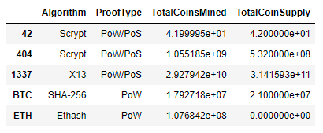
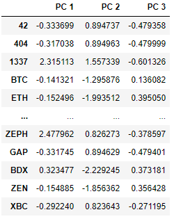
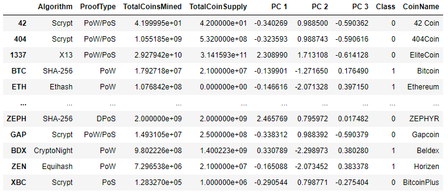
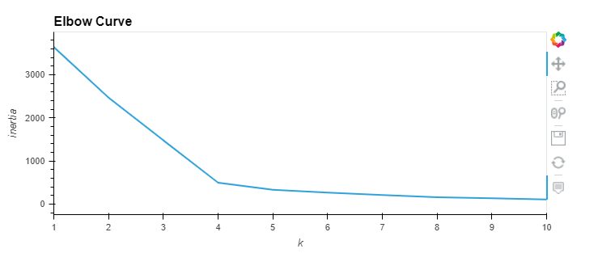
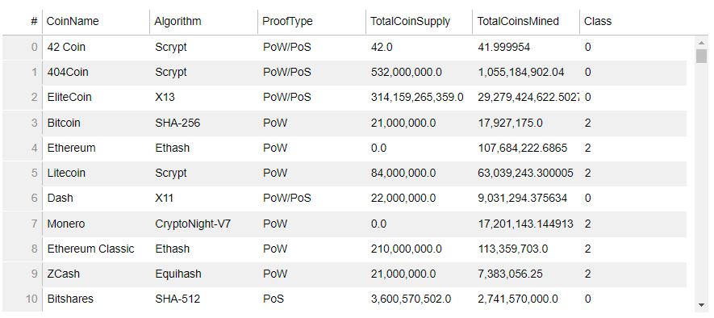
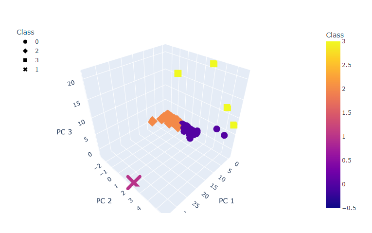
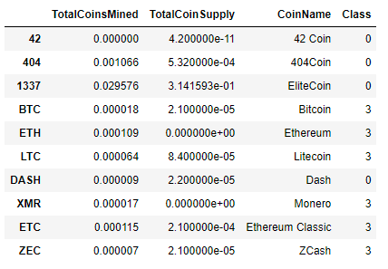
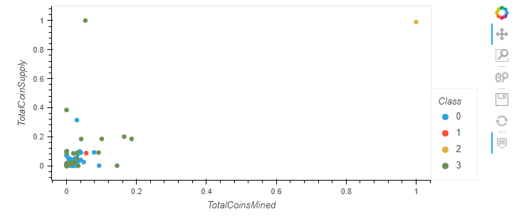

# Cryptocurrencies Analysis
Cryptocurrencies analysis using unsupervised machine learning

## Background: Accountability Accounting
Accountability Accounting, a prominent investment bank, is interested in offering a new cryptocurrency investment portfolio for its customers. The company, however, is lost in the vast universe of cryptocurrencies. So, they’ve asked you to create a report that includes what cryptocurrencies are on the trading market and how they could be grouped to create a classification system for this new investment.

## Data Source:
[CryptoCompare](https://min-api.cryptocompare.com/data/all/coinlist)

## Deliverables:

*Deliverable 1: Preprocessing the Data for PCA
*Deliverable 2: Reducing Data Dimensions Using PCA
*Deliverable 3: Clustering Cryptocurrencies Using K-means
*Deliverable 4: Visualizing Cryptocurrencies Results

## Deliverable 1: Preprocessing the Data for PCA

## Deliverable 2: Reducing Data Dimensions Using PCA

## Deliverable 3: Clustering Cryptocurrencies Using K-means

Deliverable 4: Visualizing Cryptocurrencies Results

## Summary
All requirements are fulfilled. 